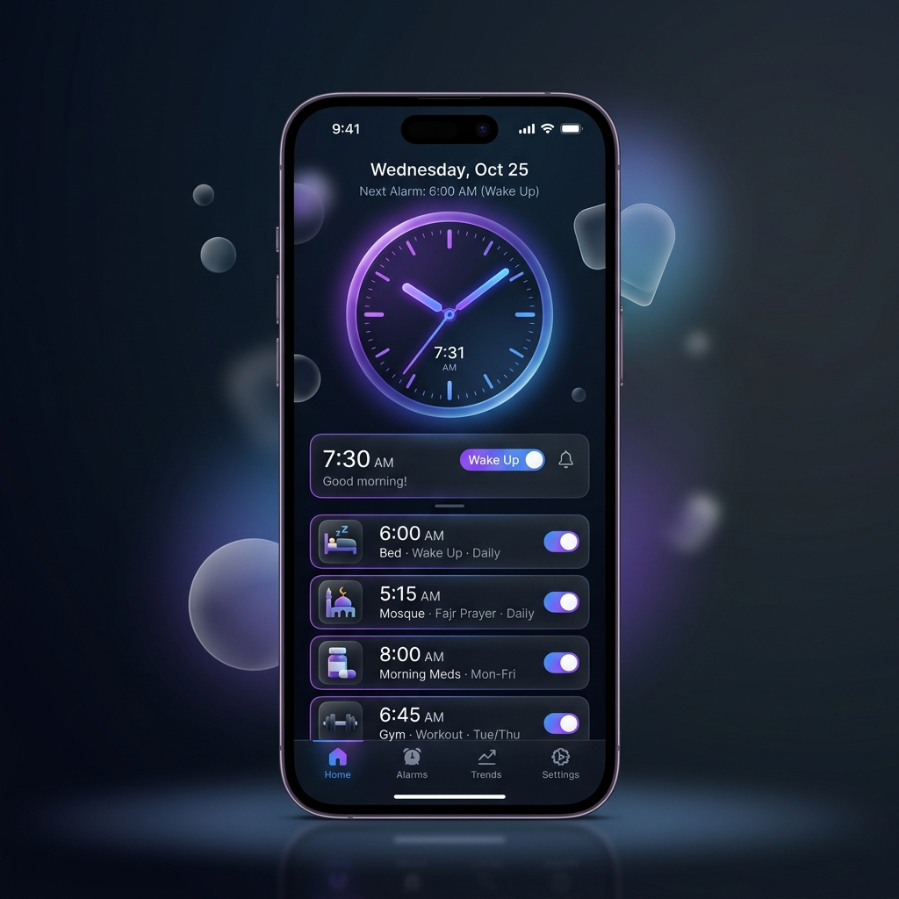

# 🚀 Aura Alarm: The Next-Gen Smart Alarm Clock



Aura Alarm is a premium, feature-rich Flutter application designed to revolutionize how you wake up. Built with a stunning **Glassmorphic UI**, Aura combines aesthetic excellence with intelligent functionality, offering specialized alarm categories and interactive wake-up challenges.

## ✨ Key Features

- **💎 Premium Glassmorphic Design**: A world-class visual experience with dark mode, blur effects, and fluid animations.
- **🕒 Smart Alarm Categories**:
  - **Sleep**: Gentle fade-in volume for a peaceful wake-up.
  - **Salat**: Specialized reminders for prayer times.
  - **Medicine**: Never miss a dose with clear labels.
  - **Focus & Meeting**: Professional alerts for your busy schedule.
- **🧩 Interactive Challenges**:
  - **Mental Math**: Solve problems to ensure your brain is awake.
  - **Shake to Stop**: Requires physical movement to dismiss the alarm.
- **⏱️ Precision Stopwatch**: High-performance stopwatch with lap tracking and circular progress visualization.
- **🎨 World-Class UI Components**:
  - Real-time **Syncfusion Analog Clock**.
  - Interactive **Day/Night Time Picker**.
  - Delightful **Lottie** animations and **Confetti** celebrations.

## 🛠️ Technology Stack

- **Framework**: Flutter
- **State Management**: [Riverpod](https://riverpod.dev/) (AsyncNotifier)
- **Animations**: `flutter_animate`, `lottie`, `confetti`
- **UI Components**: `syncfusion_flutter_gauges`, `day_night_time_picker`
- **Alarm Engine**: `alarm` package (v5.2.1)

## 🚀 Getting Started

### Prerequisites

- Flutter SDK (latest version)
- Android Studio / VS Code
- A physical device or emulator (Physical device recommended for alarm testing)

### Installation

1. **Clone the repository:**

   ```bash
   git clone https://github.com/Rejuyan/alarm_clock.git
   cd alarm_clock
   ```

2. **Install dependencies:**

   ```bash
   flutter pub get
   ```

3. **Add Audio Assets:**
   Ensure you have your `.mp3` files in the `assets/` directory (e.g., `wake_up.mp3`, `salat.mp3`).

4. **Run the app:**

   ```bash
   flutter run
   ```

## 📂 Project Structure

- `lib/models/`: Data models and category logic.
- `lib/services/`: Riverpod providers and alarm state management.
- `lib/screens/`: Immersive UI screens (List, Add, Ring, Stopwatch).
- `assets/`: Lottie animations and audio files.

---

Developed with ❤️ by **Rejuyan**
